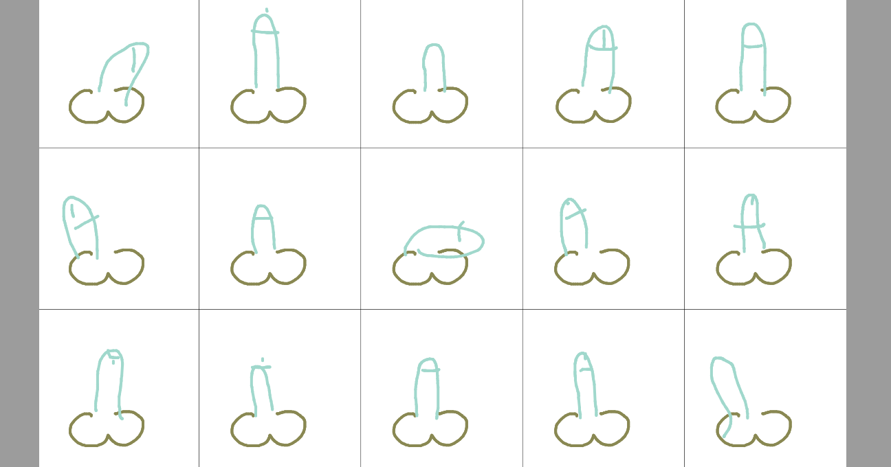
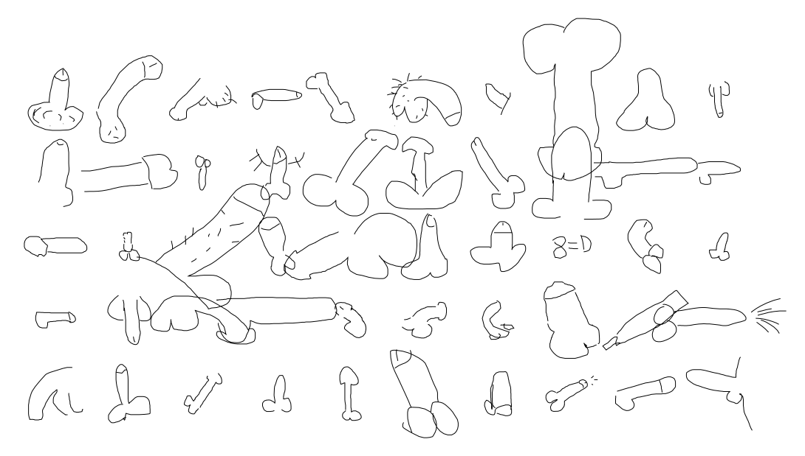

# DICK-RNN

A recurrent neural network trained to draw dicks.

Demo: https://dickrnn.github.io/

GitHub: https://github.com/dickrnn/dickrnn.github.io/

<a href="https://dickrnn.github.io/"></img></a>

This project is based on the original [sketch-rnn demo](https://magenta.tensorflow.org/assets/sketch_rnn_demo/index.html), and is a fork of [sketch-rnn-js](https://github.com/tensorflow/magenta-demos/tree/master/sketch-rnn-js/README.md), but customized for dicks.

The methodology is described in this paper: https://arxiv.org/abs/1704.03477

Dataset used for training is based on [Quickdraw-appendix](https://github.com/studiomoniker/Quickdraw-appendix).

## Media Coverage

*“Mean Time To Dick is a key measure of any given human or machine intelligence system.”* — [Elon Musk](https://twitter.com/elonmusk/status/1253834316242616328), on dick-rnn.

Reddit: dick-rnn discussions on [/r/MachineLearning](https://redd.it/g6og9l) and [r/javascript](https://redd.it/g6opsc).

Articles about dick-rnn in [The Next Web](https://thenextweb.com/neural/2020/04/24/neural-network-draw-dicks/), [Boing Boing](https://boingboing.net/2020/04/24/this-ais-only-function-is-to.html), [PC Gamer](https://www.pcgamer.com/someone-taught-an-ai-to-draw-dicks-after-feeding-it-25000-doodles-of-penises/), [Mashable](https://mashable.com/article/dickrnn-dick-doodle-neural-network-ai/), [Dlisted](https://dlisted.com/2020/04/26/hot-slut-of-the-day-2278/), [9GAG](https://9gag.com/gag/a0NvxQn/you-can-train-an-ai-to-draw-a-penis), [Código Espagueti](https://codigoespagueti.com/noticias/tecnologia/red-neuronal-10000-penes-dibujar/) and [HD Tecnologia](https://www.hd-tecnologia.com/alguien-enseno-a-una-ia-como-dibujar-penes-suministrandole-25-000-dibujos-distintos/) (Spanish), [Feber](https://feber.se/internet/ai-larde-sig-rita-penis/410425/) (Swedish), [dobreprogramy](https://www.dobreprogramy.pl/Wykorzystali-sztuczna-inteligencje-do-rysowania-penisow,News,107621.html) (Polish), [futuretech](https://futurezone.at/digital-life/kuenstliche-intelligenz-kritzelt-penisse/400824998) (Austrian German), [4Gamers](https://www.4gamers.com.tw/news/detail/42931/someone-taught-an-ai-to-draw-dicks-after-feeding-it-25000-doodles-of-penises) (Traditional Chinese), [Gigazine](https://gigazine.net/news/20200426-dickrnn/) and [Karapaia](http://karapaia.com/) (Japanese).

# Why?

From Studio Moniker's [Quickdraw-appendix](https://studiomoniker.com/projects/do-not-draw-a-penis) project:

*In 2018 Google open-sourced the [Quickdraw data set](https://github.com/googlecreativelab/quickdraw-dataset). “The world's largest doodling data set”. The set consists of 345 categories and over 50 million drawings. For obvious reasons the data set was missing a few specific categories that people seem to enjoy drawing. This made us at Moniker think about the moral reality big tech companies are imposing on our global community and that most people willingly accept this. Therefore we decided to publish an appendix to the Google Quickdraw data set.*

I also believe that [“Doodling a penis is a light-hearted symbol for a rebellious act”](https://www.theverge.com/tldr/2019/6/17/18681733/google-ai-doodle-detector-penis-protest-moniker-mozilla) and also “think our moral compasses should not be in the hands of big tech”.

# Dick Demos

[Main Dick Demo](https://dickrnn.github.io/)

[Predict Multiple Dicks](https://dickrnn.github.io/multi.html)

[Predict Single Dick](https://dickrnn.github.io/predict.html)

[Simple Dick Demo](https://dickrnn.github.io/simple.html)

## Example Dicks from Main Demo

The dicks are embedded in the query string after `share.html`.

Examples of sharable generated dick doodles:

<p align="left">
  <a href="https://dickrnn.github.io/share.html?s=f38BfXcBe3wBeHsBfH4BfX4Bdn8BfIMBdogBfIYBfYgBfogBf40BgYYBg4YBhocBiYcBhIEBlX8BhHsBg3oBgnoBgXoBgHsBf3wBf48BiowBhIQBhIIBhoABhn8Bhn4Bh3gBjHABgnoBgXsBgHsBgHoBf3IBfXgBfXsBeHYBe30Ban8BfoABfYABe4AAW2kBf2wBf2QBf24Bf2wBgHUBf3EBgHIBgHkBgHkBgnQBgXsBgnkBgXwBgnwBgX8BgoABg4EBg4IBgoQBgYMBgYMBgokBgJABf74BfosBfYYBfogBfoUBf5MBf4sBgIIAVwABgIIBgIIBgYEBgIEBgn8BiYABhX8BhX4Bgn8Bg34BgX8Bg34BgH8Bf34Bgn0AZFMBgYUBgIMBgIEBf4MBgIIBf4MAf2cBf30BgXoBgngBg3gBhHgBhHoAhXgBgncBg3sBinYBiHoAWb8Bfn8Bf38BgX8Bgn4BhH8Bhn8BjYEBh4MBhoMAMXAA"></img></a><a href="https://dickrnn.github.io/share.html?s=f38BfnYBe3sBensBeX0BeX4Bdn8BfIEBfoMBfYQBfoUBf48BgIgBhIgBiosBhIABg4ABgn4Bg3wBhXkBfX8Be4IBe4MBe4QBfYUBfoQBf4kBgIUBg4YBhIUBhYMBhIABhIABhX4BhXoBhHoBg3kBgncBgHcBgHkBf3sBfn0BfX4Bfn8Bfn4BfX4Bfn4BfX4Aa0gBhHwBhnsBiXkBiXsBinsBlHkBjXsBi3wBiX0BiX4Bh34Bjn4BiX8BhX4Bg38BhX8BhX8BgH8BgH8BgYABgIABgIEBgH8BgYABgIEBgoMBgIEBgIEBgYMBgIIBgYUBf4MBfoUBfYEBfIEBdYQBd4IBb4MBeIABd4EBd4EBZoQBbYUBdoIBd4IBeoEBdYIBeIEBeoABe4EBe4EBfYABfYABfn8BfoABfoABf38Bf38A/ikBf38Bf38Bf4EBf4QBgIQBgYMBgIEBgoMBgIEBgoQBgYEBgIEBgYEBgYEBf38Bf38Bf4AAhmsBf38Bf4ABf38Bf38Bf38Bf38Bf34Bf38Bf34Bf38Bf34Bfn8Bf38AipkA"></img></a><br/><a href="https://dickrnn.github.io/share.html?s=f38Bh30BjH8BkIMBjYQBhoQBgIgBf4sBe40BeoYBeoUBeoIBeIEBd4ABd38BdnkBeXkBe3cBe3UBfHUBenMBgn0BhH0BhHsBgn0AxocBgH8Bgn4BjHwBiH0BhX8Bgn8Bh4IBhYQBhoUBhYcBhIgBgYYBf4YBf4cBf4EBfIMBeoMBdoMBdYEBdoABd38BeH0Bd3sBensBdXEBfHcBfXcBfngBf3gAcmEBf34BgX4BgXsBgXgBgXIBgHcBgWYBgHUBf3UBgHABf3oBfnsBfnsBfnoBf30BgHwBgXsBgX0BgnwBg3wBiHoBiHsBgn4Bg38BhX8BgYABgoEBgYIBgIIBgYcBgYkBgIQBf4YBf4QBf4kBf4UBf4QBf4MBf4MBf4QBf4QBf4QBfoUBfYQBfoUBf4IBfYcBfYoBf4IBfoYBfoMBfoMBf4EAbAABf4MBf4EBf4IBf4ABfoMBf38Bf4AAfH0BgX8Bk4IBg4ABgn8BgoABgoAASrIA"></img></a><a href="https://dickrnn.github.io/share.html?s=f38BZn8BdIUBdokBeo0BfY8BfpQBhY4BiowBj4YBkIEBlH8BjHkBi3IBiXEBgnUBgXkBf6YBgYwBhYkBi4gBjYIBjIEBi38BiHkBh3UBg3MBgm0BgXIBfnMBenUBenkBdXUAAEcBhH8BhXkBiXgBi3IBkG4BkHEBk28Bk3IBnmYBi3gBi3oBk3kBiX8BioIBjYkBh4kBhYwBgYkBgY0BfY4BdZEBc48Bd4gBd4cBcYoBd4UAMDEBf4EBgoABiocBk4gBlIUBjX8Bh34BhXoAZEMBe3wBfHsBfH4BfX0BfX0AtJQBin8BhX0BhX8Bf34AqHoBf30BgX4BhXIBgn0BinUAhXoBfn8BhH4Bj3oBlXgBjH8BjYMAkKUBhH8BloQBh4IBjYUAapkBjXkBpHoBkH8Ac8YBhYcBhocBiYsBh4sBhIgARGgA"></img></a>
</p>

# Dataset

This recurrent neural network was trained on a [dataset](https://github.com/studiomoniker/Quickdraw-appendix) of roughly 10,000 dick doodles.

The [Quickdraw-appendix](https://github.com/studiomoniker/Quickdraw-appendix) dataset was processed via incremental RDP epsilons to fit most dicks within 200 steps. Note that I used the raw version, not their simplified version, since the dicks were more detailed. The processed dataset that is compatable with [sketch-rnn](https://github.com/hardmaru/sketch-rnn-datasets/)'s strokes (no pun) is in this repo as `dataset/dicks.npz` and can be loaded this way:

```python
filename = "dataset/dicks.npz"
load_data = np.load(filename)
train_set = load_data['train']
valid_set = load_data['valid']
test_set = load_data['test']

print(len(train_set))
> Output: 9500

print(len(valid_set))
> Output: 496

print(len(test_set))
> Output: 496
  
# draw a random example (see draw_strokes.py)
draw_strokes(random.choice(train_set), factor=0.5)
```

Training samples from the dataset:

<a href="https://github.com/studiomoniker/Quickdraw-appendix"></img></a>

For best results, train with default [sketch-rnn](https://github.com/tensorflow/magenta/tree/master/magenta/models/sketch_rnn) settings, but use a dropout keep probability of 80%. Early stopping was performed on the validation set. To maximize samples used for training/validation, no test set is used, and the test set is just set to the same 496 validation samples to be compatable with the data format expected by the existing code.

Command used to train the TensorFlow [sketch-rnn](https://github.com/tensorflow/magenta/tree/master/magenta/models/sketch_rnn) model:

```
python sketch_rnn_train.py --data_dir=dataset --gpu=0 --log_root=log --hparams=data_set=['dicks.npz'],num_steps=1000000,conditional=0,dec_rnn_size=512,recurrent_dropout_prob=0.8
```

I found a [Jupyter notebook](https://github.com/magenta/magenta-demos/blob/master/jupyter-notebooks/Sketch_RNN_TF_To_JS_Tutorial.ipynb) in the [sketch-rnn repo](https://github.com/magenta/magenta-demos) that easily converted the TensorFlow checkpoint into the `.gen.full.json` format that `sketch-rnn-js` can use, with the command:

```
node compress_model.js custom.gen.full.json dick.gen.js
```

*__Update (4/27/2020)__ The Quickdraw-appendix dataset was updated, and there are now 25K examples, up from the earlier 10K. I processed the newer dataset as `dicksv2.npz` with a proper train/valid/test split of 23000/1500/693 samples. The [Main Demo](https://dickrnn.github.io/) has been updated to use a larger, but slightly slower model trained on the revised dataset containing more training examples.*

# License

Original license for each file is indicated in the header comment for each source file, or referenced in the URL stated in the source file. Creative Commons License for datasets also indicated accordingly.

MIT License for my specific additional work.
